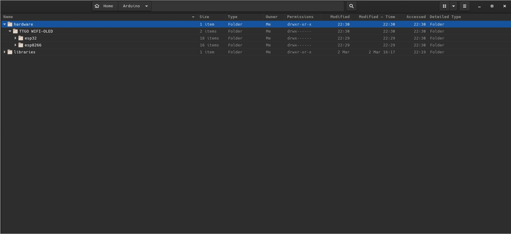

# Seed

ESO's Seed project. Point to point telemetry is here!
Mostly in C language.

[Link to the modules](https://www.aliexpress.com/item/2pcs-sets-TTGO-LORA-SX1278-ESP32-0-96-OLED-32Mt-bit-4MB-433Mhz-for-arduino/1000007920193.html?spm=2114.search0104.3.102.20579963Um61RN&ws_ab_test=searchweb0_0,searchweb201602_7_10065_10068_10547_319_317_10548_10696_10084_453_10083_454_10618_10304_10307_10820_10821_537_10302_536_10843_10059_10884_10887_321_322_10103,searchweb201603_52,ppcSwitch_0&algo_expid=34bd6c96-09bc-4eaa-b626-d0a9a77f2dad-15&algo_pvid=34bd6c96-09bc-4eaa-b626-d0a9a77f2dad&transAbTest=ae803_3).

## Getting started

The [LoRaReceiverESP32](LoRaReceiverESP32.ino) is to flash on the receiver unit.
The [LoRaSender](LoRaSender.ino) is to flash on the emmiter unit.

You have to respect the wiring diagram, because you know there are some sensors!

To implement that, we need a library for that kind of ESP32 Lora TTL which is available at [drive.google.com](https://drive.google.com/file/d/1L8ll-DeAC2SATBZn0-KbSaZsrinbnXkF/view).
You to download that big *.rar file and open it with a unrar program like 7zip.
Unzip the TTGO WIFI-OLED.zip and you get the TTGO WIFI-OLED folder.

Move the TTGO WIFI-OLED to yours Arduino's hardware folder in your Documents.

It looks something like this :



Restart Arduino and check in Tools -> Board that you have now some TTGO's board

a## Installing and flashing

Clone this git or download it as a zip

```bash
git clone https://github.com/raymas/Seed.git
```

Open the [LoRaSender](LoRaSender.ino) script with arduino, upload it with the board : ESP32_OLED with defaults parameters. Don't forget to select the correct port.
And here we go again with the other unit, flash it with the [LoRaReceiverESP32](LoRaReceiverESP32.ino) script.

Power up the two modules and observe some messages displayed on the screen.

## Wiring diagram

### Sender unit

